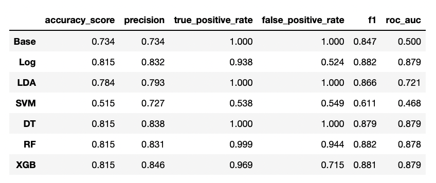
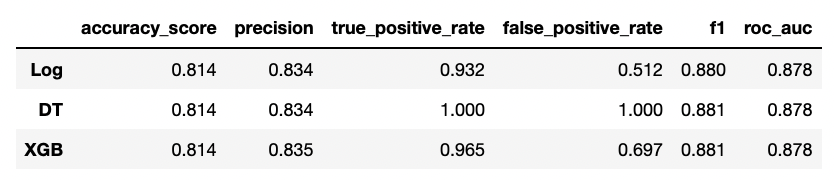

# CoverMyMeds : Prior Authorization Approval Prediction
----------

This project was provided by [CoverMyMeds](https://www.covermymeds.com/main/).

## Table of Contents
--------------------------------
- [Background](#Background)
- [Problem Statements](#Problem-Statements)
- [Data Description](#Data-Description)
- [Summary of the Notebooks](#Summary-of-the-Notebooks)

## Background
----------------
&ensp; When a doctor prescribes a therapy to a patient, they send the prescription to a pharmacy. The pharmacy, when going to fill the prescription, runs a claim against the patient’s insurance (in this context known as a Pharmacy Benefit Manager or PBM), to see if their insurance will cover the therapy as prescribed (correct drug, dosage, etc.). Thankfully, more times than not insurance companies, or payers, approve these claims and the pharmacy dispenses the medication as prescribed. The patient then picks it up and when relevant, pays the remaining cost and completes the transaction.<br>

However, payers may not cover particular medications or dosages, and may reject the claim. Claims can be rejected for a variety of reasons. For example, the dosage or quantity dispensed may not be covered, or the drug might not be on formulary. A formulary is a list of the preferred drugs a payer has. Typically, formularies are tiered, with some drugs being the cheapest, some being more costly but covered, and some requiring a prior authorization for example.<br>

&ensp; When a claim is rejected, a “reject code” is provided which contextualizes the reason the claim was rejected. For our purposes, there are 3 rejection codes that we focus on: 70, 75, and 76. A code 70 implies that a drug is not covered by the plan and is not on formulary, and typically implies that another course of therapy should be pursued. A code 75 implies that a drug is on the formulary but does not have preferred status and requires a prior authorization (PA). A PA is a form that care providers submit on behalf of their patient making the case that the therapy as described is a critical course of treatment. A code 76 simply means that the drug is covered, but that the plan limitations have been exceeded, which means that the limitations on the number of fills for that medication has been met. We might expect there to be variation in the type of reject codes we see for certain drugs by the payer.<br>

&ensp; If a claim is rejected, regardless of the reject code provided, a prior authorization can be started to prevent prescription abandonment and ensure a patient gets the therapy their provider thinks would work best for them. When a provider is filling out a PA, they may frequently be asked to provide information about a patient’s diagnosis, lab values, contraindications (health-related reasons not to take certain medications), and if they have tried and failed other therapies. When reviewing prior authorizations, payers evaluate the information provided against their formulary and make a decision. That is to say, information contained on the PA and information contained in the original pharmacy claim can help us understand whether an ePA is likely to be approved or denied.

##  Problem Statements
---------------------------------
Our project focuses on predicting PA approval, but we will also explore the related issue of predicting pharmacy claim approval. This analysis will provide additional insights that can help us address the main question more effectively."
### Problem 1 : from Notebook 1 to 4
----------------------------------------
We will predict whether a PA will be successful based upon claims data, or data included on the ePA, to prevent patients from waiting on a decision, only to end up having to switch to another therapy if the PA is rejected. More precisely, we will build a classifier using the features `bin`, `drug`, `correct_diagnosis`, `reject_code`, `tried_and_failed` and `contraindication` to predict prior authorization approval(`pa_approved`).

### Problem 2 : Notebook 0
------------------------------
We will try to predict whether a PA will be needed at the point of prescribing to prevent a patient from going to the pharmacy, only to return home empty handed. More precisely,  We will build a classifier using the features `bin`, `drug` to predict pharmacy claim approval(`pharmacy_claim_approved`).

## Data Description
------------------------------------

### dim_claims.csv
This is a table containing pharmacy claim-level information of 1,335,576 patients. It contains the following columns:
- `dim_claim_id`: Primary key and index. Integer.
- `bin`: The BIN of the payer for the claim. Numeric.
- `drug`: The drug that was associated with the claim. Character. reject_code: If the claim was rejected, what was the associated rejection code. Character.
- `pharmacy_claim_approved`: Flag for if the claim was approved by the payer. Bit.

### dim_pa.csv
This is a table containing PA-level for 555,951 rejected pharmacy claim in dim_claims. It contains the following columns:
- `dim_pa_id`: Primary key and index. Integer.
- `correct_diagnosis`: Flag for information provided by the provider indicating that the patient has the correct diagnosis for the associated drug. Bit.
- `tried_and_failed`: Flag for information provided by the provider indicating that the patient has tried and failed the relevant generic alternatives. Bit.
- `contraindication`: Flag for information provided by the provider indicating that the patient has an associated contraindication for the medication requested. Bit.
- `pa_approved`: Flag for if the payer favorably reviewed and approved the PA. Bit.

### bridge.csv
This is a bridge table that links the primary keys of all the tables to one another that is used for joining the tables. o It contains the following columns:
- `dim_claim_id`: Primary key for dim_claims. 
- `dim_pa_id`: Primary key for dim_pa. 
- `dim_date_id`: Primary key for dim_date. This column will not be used in our project.

## Summary of the Notebooks
----------------------------------------
### 0. Exploratory Data Analysis - pharmacy claim approval
----------------------------------------
In Notebook 0, we analyze the related problem of predicting pharmacy claim approval. Although this task is not directly tied to our main objective, it provides valuable insights into the data we are working with
### 1. Exploratory Data Analysis - prior authorization approval
----------------------------------------
After conducting exploratory data analysis, 
- we found that the feature `reject_code` was redundant and removed it.
- Additionally, we added interaction terms for the pairs (`bin`, `drug`), (`tried_and_failed`, `drug`), and (`contraindication`, `drug`) to further enhance our analysis."

### 2. Feature Selection and Hyperparameter Tuning - prior authorization approval
----------------------------------------
We perform feature selection and hyperparameter tuning for several models, including logistic regression, linear discriminant analysis, support vector machine, decision tree, random forest, and xgboost."


### 3. Model Selection - prior authorization approal
----------------------------------------
Using the features and hyperparameters obtained in the previous notebook, we calculated several key performance indicators for the models.



- Base : baseline model
- Log : logistic regression
- LDA : linear discriminant analysis
- SVM : support vector machine
- DT : decision tree
- RF : random forest
- XGB : xgboost

We decided logistic regression as our classifier.

### 4. Model Assessment - prior authorization approal
----------------------------------------
Although we chose logistic regression, we will also evaluate the performance of other models that performed well on the training data, specifically decision tree and xgboost. To assess the generalization ability of our models, we evaluated their performance on the test data. Furthermore, we conducted a bias-variance analysis and computed confidence intervals for key performance indicators of all three models. Below is the key performance indicators of the models logistic(regression, decision tree and XGBoost).




```python

```
